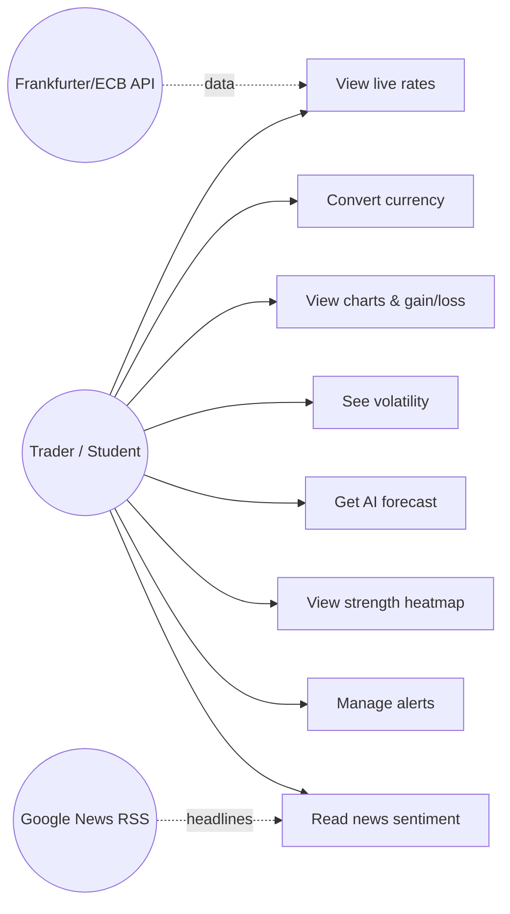
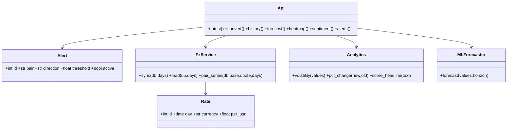
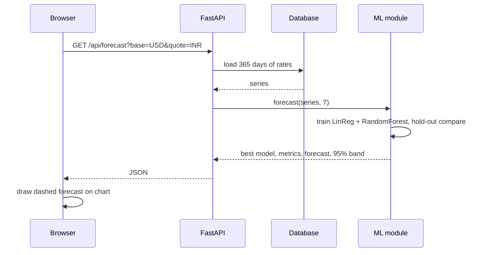
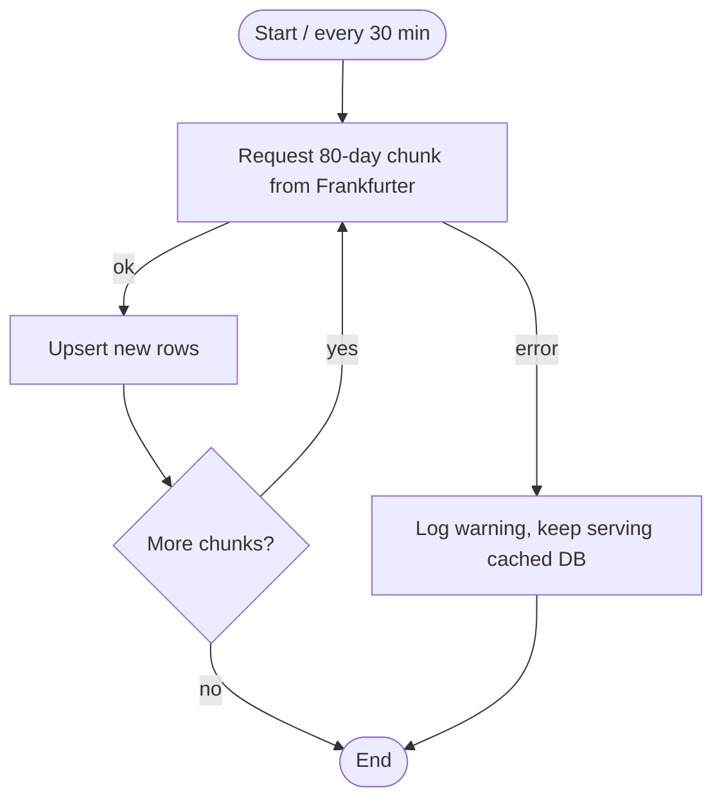

# UML Diagrams (Mermaid – renders on GitHub / VS Code "Markdown Preview Mermaid Support")

## Use case

```mermaid
flowchart LR
  U((Trader / Student)) --> A[View live rates] & B[Convert currency] & C[View charts & gain/loss] & D[See volatility] & E[Get AI forecast] & F[View strength heatmap] & G[Manage alerts] & H[Read news sentiment]
  S((Frankfurter/ECB API)) -.data.-> A
  N((Google News RSS)) -.headlines.-> H
```

## Class diagram

```mermaid
classDiagram
  class Rate{+int id +date day +str currency +float per_usd}
  class Alert{+int id +str pair +str direction +float threshold +bool active}
  class FxService{+sync(db,days) +load(db,days) +pair_series(db,base,quote,days)}
  class Analytics{+volatility(values) +pct_change(new,old) +score_headline(text)}
  class MLForecaster{+forecast(values,horizon)}
  class Api{+latest() +convert() +history() +forecast() +heatmap() +sentiment() +alerts()}
  Api --> FxService
  Api --> Analytics
  Api --> MLForecaster
  FxService --> Rate
  Api --> Alert
```

## Sequence: forecast request

```mermaid
sequenceDiagram
  participant B as Browser
  participant A as FastAPI
  participant D as Database
  participant M as ML module
  B->>A: GET /api/forecast?base=USD&quote=INR
  A->>D: load 365 days of rates
  D-->>A: series
  A->>M: forecast(series, 7)
  M->>M: train LinReg + RandomForest, hold-out compare
  M-->>A: best model, metrics, forecast, 95% band
  A-->>B: JSON
  B->>B: draw dashed forecast on chart
```

## Activity: data sync

```mermaid
flowchart TD
  S([Start / every 30 min]) --> R[Request 80-day chunk from Frankfurter]
  R -->|ok| U[Upsert new rows] --> M{More chunks?}
  M -->|yes| R
  M -->|no| E([End])
  R -->|error| C[Log warning, keep serving cached DB] --> E
```
